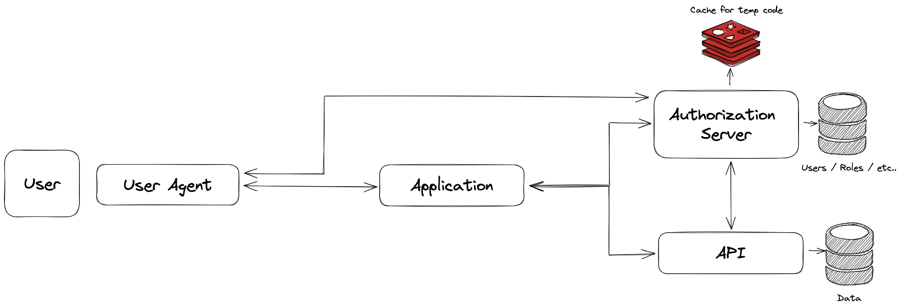
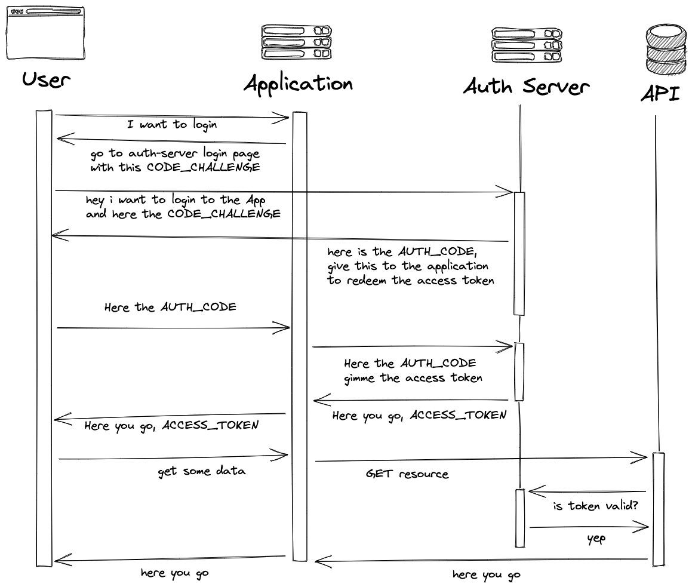

# OAuth2 Example

# Lay of the Land

# The Flow

# TODO
- [] Remove redis for now, put in nest in memory cache
- [] add the oauth/token api to redeem token from auth_code
- [] add scope and redirect uris in app registration
- [] create small app frontend to login via auth server and fetch secret from api server
- [] create small auth frontend to fill in login creds and redirect to application frontend with auth_code
- [] create simple CRUD nestjs app for the secret API
